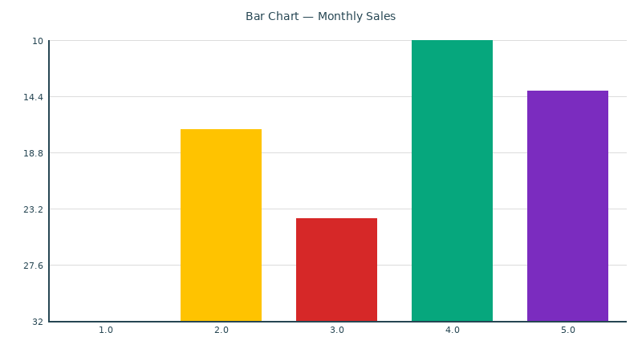
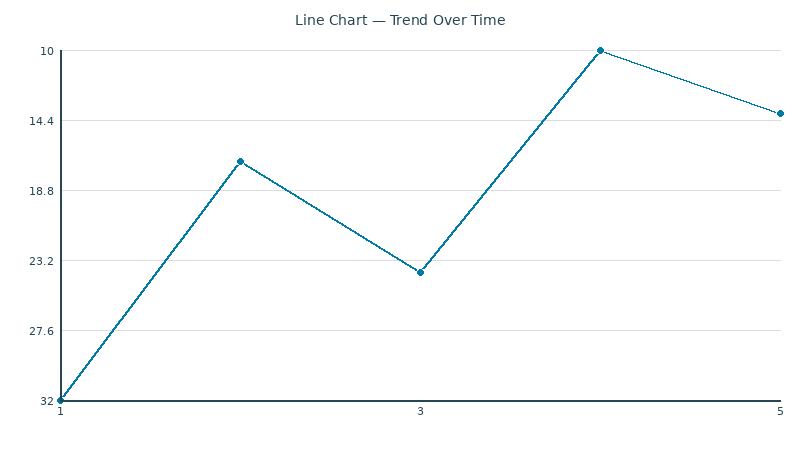

# vizkit

```text
   |       |      |\\
   |  |    |      | \\
   |  |  __|__    |  |   VIZKIT
 __|__|_|  |  |___|  |   data in · insight out
```

**Beautiful data visualization from CSV/JSON in 3 lines of code.**

Bar, line, scatter, heatmap, and pie charts with sensible defaults, color themes, and PNG export. Built on Pillow — no heavy dependencies, no browser required.

[](https://www.python.org/)
[](LICENSE)
[](https://python-pillow.org/)




*Bar and line charts from the same data — one code path each.*

## Quickstart

```bash
pip install -e .
```

```python
from vizkit import Data, Chart

data = Data.from_csv("sales.csv")
chart = Chart(data, "bar", "month", "revenue", title="Monthly Revenue")
chart.save("revenue_chart.png")
```

Three lines. Publication-quality chart. Done.

## What it does

vizkit turns tabular data into clean, colorful charts without the complexity of matplotlib or the browser dependency of web-based tools.

- **Bar charts** — compare categories with color-coded bars
- **Line charts** — show trends over time with smooth connected points
- **Scatter plots** — reveal correlations with colored data points
- **Heatmaps** — visualize 2D data density with gradient coloring
- **Pie charts** — show proportions with labeled segments and percentages

Every chart type supports:
- Custom titles and axis labels
- Light and dark color themes
- Sensible defaults that look good without tweaking
- PNG export at configurable resolution

## Features

- **Zero config by default** — sensible colors, fonts, and spacing out of the box
- **Light and dark themes** — `Theme.light()` and `Theme.dark()` with colorblind-friendly palettes
- **10-color palette** — cerulean, sunflower, crimson, emerald, violet, sandy, slate, coral, sky, orange
- **Pillow-only dependency** — no matplotlib, no browser, no JavaScript
- **CSV and JSON input** — `Data.from_csv()` and `Data.from_json()`
- **Programmatic API** — build charts in code, no CLI required
- **PNG export** — `chart.save("output.png")` or `chart.to_png_bytes()` for in-memory use

## Installation

```bash
# From a clone
git clone https://github.com/yourusername/vizkit.git
cd vizkit
pip install -e .

# Or install directly
pip install vizkit
```

Requires Python 3.9+ and Pillow:

```bash
pip install Pillow
```

## Usage

### Bar chart from CSV

```python
from vizkit import Data, Chart, Theme

data = Data.from_csv("sales.csv")  # columns: month, revenue
chart = Chart(
    data,
    kind="bar",
    x="month",
    y="revenue",
    title="2024 Sales by Month",
    theme=Theme.light(),
)
chart.save("sales_bar.png")
```

### Line chart with custom theme

```python
from vizkit import Data, Chart, Theme

data = Data.from_json("temps.json")  # columns: date, temp
chart = Chart(
    data,
    kind="line",
    x="date",
    y="temp",
    title="Daily Temperature",
    theme=Theme.dark(),
)
chart.save("temps_line.png")
```

### Scatter plot

```python
from vizkit import Data, Chart

data = Data.from_csv("experiment.csv")  # columns: x, y
Chart(data, "scatter", "x", "y", title="Experiment Results").save("scatter.png")
```

### Heatmap

```python
from vizkit import Data, Chart

# columns: hour, day, temperature
data = Data.from_csv("room_temps.csv")
Chart(data, "heatmap", "hour", "day", "temperature", title="Room Temperature Heatmap").save("heatmap.png")
```

### Pie chart

```python
from vizkit import Data, Chart

data = Data.from_csv("market_share.csv")  # columns: company, share
Chart(data, "pie", "company", "share", title="Market Share").save("pie.png")
```

### Programmatic PNG output

```python
from vizkit import Data, Chart

data = Data({"x": [1, 2, 3], "y": [10, 20, 30]})
chart = Chart(data, "bar", "x", "y")
png_bytes = chart.to_png_bytes()  # bytes object, no file written
# Send to API, embed in PDF, etc.
```

## Project structure

```
vizkit/
├── __init__.py    # Public API: Chart, Theme, Data
├── chart.py       # Chart engine — bar, line, scatter, heatmap, pie rendering
├── color.py       # Color utilities, palettes, Theme class
├── data.py        # CSV/JSON data loading
└── util.py        # Internal helpers (font loading, theme resolution)
```

## Requirements

- Python 3.9+
- Pillow 10.0+

## License

MIT License — see [LICENSE](LICENSE).

## Contributing

Pull requests welcome. The codebase is small and straightforward — chart rendering lives in `chart.py`, colors in `color.py`, data loading in `data.py`.
